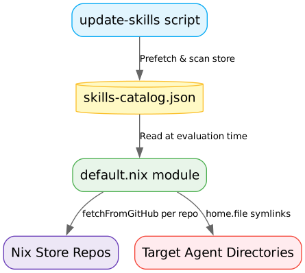

* Architecture

#+begin_src dot :file architecture.png :exports results
digraph G {
    rankdir=TD;
    node [shape=box, style="filled,rounded", fillcolor="#f9f9f9", color="#333333", fontname="sans-serif"];
    edge [color="#666666", fontname="sans-serif", fontsize=10];

    update_skills [label="update-skills script", fillcolor="#e1f5fe", color="#03a9f4"];
    catalog [label="skills-catalog.json", shape=cylinder, fillcolor="#fff9c4", color="#fbc02d"];
    nix_module [label="default.nix module", fillcolor="#e8f5e9", color="#4caf50"];
    store_repos [label="Nix Store Repos", fillcolor="#ede7f6", color="#673ab7"];
    targets [label="Target Agent Directories", fillcolor="#ffebee", color="#f44336"];

    update_skills -> catalog [label="Prefetch & scan store"];
    catalog -> nix_module [label="Read at evaluation time"];
    nix_module -> store_repos [label="fetchFromGitHub per repo"];
    nix_module -> targets [label="home.file symlinks"];
}
#+end_src

#+RESULTS:

** Design Decisions

1. *Deterministic & Offline-Safe Builds*: Pinned hashes and commit SHAs are locked in =skills-catalog.json=. Builds are 100% reproducible and offline-safe.
2. *Efficient Local Prefetching*: The update script fetches each repository archive once via =nix-prefetch-url= and parses =SKILL.md= files locally inside the Nix store path, avoiding GitHub API rate limits.
3. *Cross-Repository Collision Resolution*: If two repositories define a skill with the same name (e.g. =tdd=), the update script automatically prefixes them with the repository key (e.g., =cursor-tdd= and =pocock-tdd=).

-----

* Updating the Catalog

The catalog (=skills-catalog.json=) pins exact commit SHAs and hashes for every upstream skills repository. It needs to be updated periodically to pick up new skills and revisions.

** Automatic Updates (GitHub Action)

A daily GitHub Action runs at 08:00 UTC, executes =update-skills.nu=, and pushes any catalog changes directly to =main=. No intervention required.

To trigger it manually, go to the Actions tab and run the "Daily Skills Catalog Update" workflow.

** Manual Updates

*** From the development shell

Enter the repository and run =update-skills= (available on =$PATH= via the devShell):
#+begin_src bash
cd ~/dev/agentic-skills
nix develop  # or let direnv handle it
update-skills
#+end_src

*** Update all repositories
#+begin_src bash
update-skills
#+end_src

*** Update specific repositories
#+begin_src bash
update-skills -r anthropics,vercel
#+end_src

*** Interactive mode (select from a list)
#+begin_src bash
update-skills -i
#+end_src

*** Custom catalog path
#+begin_src bash
update-skills --catalog-path /path/to/skills-catalog.json
#+end_src

** After updating

Commit the updated =skills-catalog.json= and push. Consumers pick up the changes by running:
#+begin_src bash
nix flake update agentic-skills   # in their dotfiles repo
home-manager switch
#+end_src

-----

* Developing

** Prerequisites

- [[https://nixos.org/][Nix]] with flakes enabled
- [[https://github.com/nushell/nushell][Nushell]] (provided by the devShell)

** Development Shell

The flake provides a devShell with Nushell and the =update-skills= command:
#+begin_src bash
cd ~/dev/agentic-skills
nix develop
#+end_src

Or if you use [[https://github.com/direnv/direnv][direnv]], add a =.envrc=:
#+begin_src bash
use flake
#+end_src

** Repository Structure

| File / Directory                          | Purpose                                           |
|-------------------------------------------+---------------------------------------------------|
| =flake.nix=                               | Flake definition: module, packages, devShell      |
| =default.nix=                             | Home Manager module implementation                |
| =skills-catalog.json=                     | Pinned catalog of all skill repositories and SHAs |
| =update-skills.nu=                        | Nushell script to refresh the catalog             |
| =.github/workflows/update-skills.yml=     | Daily automated catalog update                    |
| =README.org=                              | This file                                         |
| =architecture.png=                        | Architecture diagram                              |

** Adding a New Upstream Repository

1. Open =update-skills.nu=
2. Add an entry to the =repo_configs= list:
   #+begin_src nu
   { key: "my-repo", owner: "github-owner", repo: "repo-name", skills_path: "skills" }
   #+end_src
3. Run =update-skills -r my-repo= to fetch and index it
4. Commit =update-skills.nu= and =skills-catalog.json=

The script will automatically scan for =SKILL.md= files, extract descriptions from YAML frontmatter, and resolve name collisions.

** Modifying the Home Manager Module

The module lives in =default.nix=. Key extension points:

- *Agent targets*: Add new agents in the =agentTargets= attrset (line ~20)
- *Skill options*: The options are dynamically generated from =skills-catalog.json=, so adding skills to the catalog automatically exposes them as typed options

-----

* Testing

** Build Verification

Check that the flake evaluates and passes basic checks:
#+begin_src bash
nix flake check
#+end_src

** Testing =update-skills= in the devShell

Enter the development shell to load Nushell and place the built =update-skills= package on your =$PATH=:
#+begin_src bash
nix develop
#+end_src

Run the script to verify it successfully updates the local catalog:
#+begin_src bash
update-skills --repos all
#+end_src

Confirm that changes are correctly written directly to the local =skills-catalog.json= file.

** Testing Downstream Integration

To test your local modifications to this flake (e.g., in `/home/justin/dev/agentic-skills`) downstream in your dotfiles repository without modifying your dotfiles flake inputs or pushing to remote, you can override the input path on the command line:

#+begin_src bash
home-manager build --override-input agentic-skills ~/dev/agentic-skills --impure
#+end_src

This tells Nix to resolve the `agentic-skills` input to your local checkout directory rather than the remote GitHub URL.

To dry-run or inspect without building fully:
#+begin_src bash
home-manager build --override-input agentic-skills ~/dev/agentic-skills --dry-run --impure
#+end_src

** Inspecting Options via Nix REPL

You can inspect the generated options using the Nix REPL inside your dotfiles:
#+begin_src bash
nix repl
#+end_src

In the REPL:
#+begin_src nix
nix-repl> :lf .
nix-repl> homeConfigurations."your-user@your-host".config.modules.agentic-skills
#+end_src

** Verifying Symlinks

After running a full activation (`home-manager switch`), verify the symlinks are correctly created in your target agent directories:
#+begin_src bash
ls -la ~/.gemini/skills/
ls -la ~/.claude/skills/
ls -la ~/.kiro/skills/
#+end_src

Each enabled skill should be a symlink pointing to the corresponding path in the Nix store.
